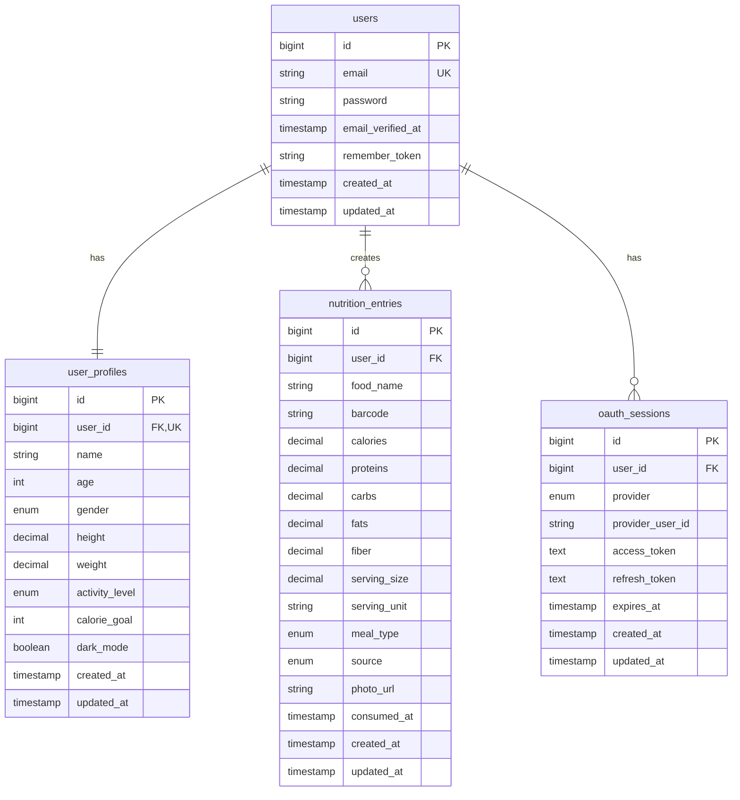

# Database Schema - NutriTrackPro

## Entity-Relationship Diagram (ERD)



## Table Details

### `users`
**Description:** Core authentication table for user accounts

| Column | Type | Constraints | Description |
|--------|------|-------------|-------------|
| id | BIGINT UNSIGNED | PK, AUTO_INCREMENT | Unique user identifier |
| email | VARCHAR(255) | UNIQUE, NOT NULL | User email (login) |
| password | VARCHAR(255) | NOT NULL | Bcrypt hashed password |
| email_verified_at | TIMESTAMP | NULL | Email verification timestamp |
| remember_token | VARCHAR(100) | NULL | "Remember me" token |
| created_at | TIMESTAMP | DEFAULT CURRENT_TIMESTAMP | Account creation date |
| updated_at | TIMESTAMP | ON UPDATE CURRENT_TIMESTAMP | Last update date |

**Indexes:**
- PRIMARY KEY (`id`)
- UNIQUE KEY (`email`)
- INDEX (`email`)

---

### `user_profiles`
**Description:** Extended user information and preferences

| Column | Type | Constraints | Description |
|--------|------|-------------|-------------|
| id | BIGINT UNSIGNED | PK, AUTO_INCREMENT | Profile ID |
| user_id | BIGINT UNSIGNED | FK, UNIQUE, NOT NULL | Reference to users.id |
| name | VARCHAR(255) | NOT NULL | Display name |
| age | INT UNSIGNED | NULL | User age (years) |
| gender | ENUM | NULL | 'male', 'female', 'other' |
| height | DECIMAL(5,2) | NULL | Height in cm |
| weight | DECIMAL(5,2) | NULL | Weight in kg |
| activity_level | ENUM | DEFAULT 'moderate' | 'sedentary', 'light', 'moderate', 'active', 'very_active' |
| calorie_goal | INT UNSIGNED | DEFAULT 2000 | Daily calorie target |
| dark_mode | BOOLEAN | DEFAULT FALSE | UI theme preference |
| created_at | TIMESTAMP | DEFAULT CURRENT_TIMESTAMP | Profile creation |
| updated_at | TIMESTAMP | ON UPDATE CURRENT_TIMESTAMP | Last profile update |

**Indexes:**
- PRIMARY KEY (`id`)
- UNIQUE KEY (`user_id`)
- FOREIGN KEY (`user_id`) REFERENCES `users(id)` ON DELETE CASCADE

---

### `nutrition_entries`
**Description:** Food consumption records with nutritional data

| Column | Type | Constraints | Description |
|--------|------|-------------|-------------|
| id | BIGINT UNSIGNED | PK, AUTO_INCREMENT | Entry ID |
| user_id | BIGINT UNSIGNED | FK, NOT NULL | Owner of entry |
| food_name | VARCHAR(255) | NOT NULL | Food item name |
| barcode | VARCHAR(50) | NULL | Product barcode (if scanned) |
| calories | DECIMAL(8,2) | NOT NULL | Calories (kcal) |
| proteins | DECIMAL(8,2) | DEFAULT 0 | Proteins (g) |
| carbs | DECIMAL(8,2) | DEFAULT 0 | Carbohydrates (g) |
| fats | DECIMAL(8,2) | DEFAULT 0 | Fats (g) |
| fiber | DECIMAL(8,2) | DEFAULT 0 | Dietary fiber (g) |
| serving_size | DECIMAL(8,2) | DEFAULT 100 | Portion size |
| serving_unit | VARCHAR(50) | DEFAULT 'g' | Unit (g, ml, oz, etc.) |
| meal_type | ENUM | NULL | 'breakfast', 'lunch', 'dinner', 'snack' |
| source | ENUM | NOT NULL | 'barcode', 'photo', 'manual' |
| photo_url | VARCHAR(500) | NULL | URL of food photo |
| consumed_at | TIMESTAMP | DEFAULT CURRENT_TIMESTAMP | When food was eaten |
| created_at | TIMESTAMP | DEFAULT CURRENT_TIMESTAMP | Record creation |
| updated_at | TIMESTAMP | ON UPDATE CURRENT_TIMESTAMP | Last update |

**Indexes:**
- PRIMARY KEY (`id`)
- INDEX (`user_id`, `consumed_at`) - Optimized for date range queries
- INDEX (`meal_type`) - Meal filtering
- FOREIGN KEY (`user_id`) REFERENCES `users(id)` ON DELETE CASCADE

**Business Rules:**
- All nutritional values are per serving_size
- consumed_at can be backdated (user adds forgotten meal)
- photo_url stored if source='photo' (Clarifai analysis)
- barcode stored if source='barcode' (Open Food Facts)

---

### `oauth_sessions`
**Description:** Social login OAuth tokens (Google, Facebook)

| Column | Type | Constraints | Description |
|--------|------|-------------|-------------|
| id | BIGINT UNSIGNED | PK, AUTO_INCREMENT | Session ID |
| user_id | BIGINT UNSIGNED | FK, NOT NULL | Linked user account |
| provider | ENUM | NOT NULL | 'google', 'facebook' |
| provider_user_id | VARCHAR(255) | NOT NULL | User ID from OAuth provider |
| access_token | TEXT | NULL | OAuth access token |
| refresh_token | TEXT | NULL | OAuth refresh token |
| expires_at | TIMESTAMP | NULL | Token expiration |
| created_at | TIMESTAMP | DEFAULT CURRENT_TIMESTAMP | First OAuth login |
| updated_at | TIMESTAMP | ON UPDATE CURRENT_TIMESTAMP | Token refresh |

**Indexes:**
- PRIMARY KEY (`id`)
- UNIQUE KEY (`provider`, `provider_user_id`) - One account per provider
- FOREIGN KEY (`user_id`) REFERENCES `users(id)` ON DELETE CASCADE

---

### `password_resets`
**Description:** Temporary tokens for password reset emails

| Column | Type | Constraints | Description |
|--------|------|-------------|-------------|
| email | VARCHAR(255) | NOT NULL | User email requesting reset |
| token | VARCHAR(255) | NOT NULL | Unique reset token |
| created_at | TIMESTAMP | DEFAULT CURRENT_TIMESTAMP | Token generation time |

**Indexes:**
- INDEX (`email`)
- INDEX (`token`)

**Business Rules:**
- Tokens expire after 60 minutes
- Deleted after successful password reset
- One active token per email (upsert on new request)

---

## Sample Data

### users
```sql
INSERT INTO users (id, email, password, email_verified_at) VALUES
(1, 'john.doe@example.com', '$2y$10$92IXUNpkjO0rOQ5byMi.Ye4oKoEa3Ro9llC/.og/at2.uheWG/igi', NOW()),
(2, 'jane.smith@example.com', '$2y$10$92IXUNpkjO0rOQ5byMi.Ye4oKoEa3Ro9llC/.og/at2.uheWG/igi', NOW());
```

### user_profiles
```sql
INSERT INTO user_profiles (user_id, name, age, gender, height, weight, activity_level, calorie_goal) VALUES
(1, 'John Doe', 30, 'male', 178.00, 75.00, 'moderate', 2000),
(2, 'Jane Smith', 28, 'female', 165.00, 62.00, 'active', 1800);
```

### nutrition_entries
```sql
INSERT INTO nutrition_entries (user_id, food_name, barcode, calories, proteins, carbs, fats, fiber, serving_size, meal_type, source, consumed_at) VALUES
(1, 'Banana', NULL, 89.00, 1.10, 22.80, 0.30, 2.60, 100.00, 'breakfast', 'manual', '2024-01-15 08:30:00'),
(1, 'Nutella', '3017620422003', 539.00, 6.30, 57.50, 30.90, 0.00, 100.00, 'breakfast', 'barcode', '2024-01-15 08:35:00'),
(2, 'Grilled Chicken Salad', NULL, 320.00, 35.00, 12.00, 15.00, 4.50, 250.00, 'lunch', 'photo', '2024-01-15 12:30:00');
```

---

## Relationships

### One-to-One
- `users` → `user_profiles` (1:1)
  - Each user has exactly one profile
  - Cascade delete: deleting user removes profile

### One-to-Many
- `users` → `nutrition_entries` (1:N)
  - User can have unlimited nutrition entries
  - Cascade delete: deleting user removes all entries

- `users` → `oauth_sessions` (1:N)
  - User can link multiple OAuth providers (Google + Facebook)
  - Cascade delete: deleting user removes OAuth links

---

## Query Performance Optimization

### Common Queries

**1. Daily nutrition summary:**
```sql
SELECT
    DATE(consumed_at) as date,
    SUM(calories) as total_calories,
    SUM(proteins) as total_proteins,
    SUM(carbs) as total_carbs,
    SUM(fats) as total_fats
FROM nutrition_entries
WHERE user_id = ?
  AND consumed_at >= ?
  AND consumed_at < ?
GROUP BY DATE(consumed_at);
```
**Optimization:** Index on `(user_id, consumed_at)`

---

**2. Recent entries (history page):**
```sql
SELECT *
FROM nutrition_entries
WHERE user_id = ?
ORDER BY consumed_at DESC
LIMIT 50;
```
**Optimization:** Index on `(user_id, consumed_at)`

---

**3. Meal type breakdown:**
```sql
SELECT
    meal_type,
    COUNT(*) as count,
    SUM(calories) as total_calories
FROM nutrition_entries
WHERE user_id = ?
  AND DATE(consumed_at) = CURDATE()
GROUP BY meal_type;
```
**Optimization:** Index on `meal_type`

---

## Migration Strategy

### Phase 1: Core Tables
```bash
php artisan migrate --path=/database/migrations/001_create_users_table.php
php artisan migrate --path=/database/migrations/002_create_user_profiles_table.php
```

### Phase 2: Nutrition Features
```bash
php artisan migrate --path=/database/migrations/003_create_nutrition_entries_table.php
```

### Phase 3: OAuth
```bash
php artisan migrate --path=/database/migrations/004_create_oauth_sessions_table.php
php artisan migrate --path=/database/migrations/005_create_password_resets_table.php
```

---

## Backup & Maintenance

### Daily Backup
```bash
mysqldump -u root -p nutritrakpro > backup_$(date +%Y%m%d).sql
```

### Table Optimization
```sql
OPTIMIZE TABLE nutrition_entries;
ANALYZE TABLE nutrition_entries;
```

### Data Retention Policy
- **nutrition_entries**: Keep all data (user can delete manually)
- **password_resets**: Auto-delete tokens older than 60 minutes
- **oauth_sessions**: Refresh tokens expire per provider policy

---

**Schema Version:** 1.0.0
**Last Updated:** 2025-01-09
